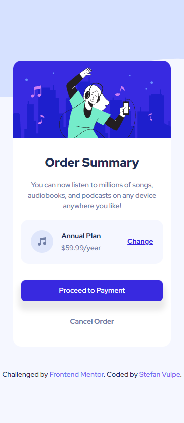

# Frontend Mentor - Order summary card solution

This is a solution to the [Order summary card challenge on Frontend Mentor](https://www.frontendmentor.io/challenges/order-summary-component-QlPmajDUj). Frontend Mentor challenges help you improve your coding skills by building realistic projects. 

## Table of contents

- [Overview](#overview)
  - [Screenshots](#screenshots)
  - [Links](#links)
- [My process](#my-process)
  - [Built with](#built-with)
- [Author](#author)

## Overview

### Screenshots

### Links

- Solution URL: [See here](https://github.com/stefanvulpe-dev/order-summary-component)
- Live Site URL: [See here](https://stefanvulpe-dev.github.io/order-summary-component/)

## My process

### Built with

- Semantic HTML5 markup
- CSS custom properties
- Flexbox
- CSS Grid
- Mobile-first workflow

## Author

- Website - [Stefan Vulpe](https://github.com/stefanvulpe-dev)
- Frontend Mentor - [@stefanvulpe-dev](https://www.frontendmentor.io/profile/stefanvulpe-dev)
- Twitter - [@TitanAsh](https://twitter.com/TitanAsh)

